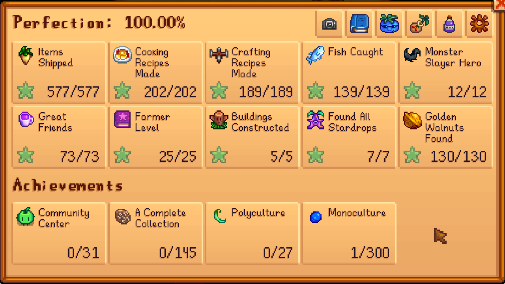
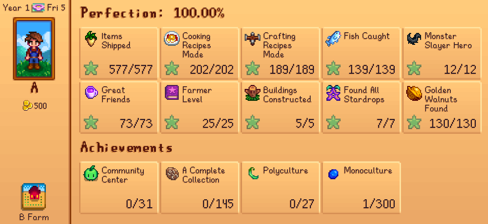

# PerfectionHandbook

A menu for tracking your perfection progress Stardew Valley.

## Installation

1. Download and install SMAPI.
2. Download and install StardewUI.
3. Download this mod and install to the Mods folder.

## The Handbook

You can open the handbook via these means:

* Keybind (Default: RightShift+H)
* Perfection Handbook item, sold by the Bookseller
* [Iconic Framework](https://www.nexusmods.com/stardewvalley/mods/11026)
* [Launcher Drawer](https://www.nexusmods.com/stardewvalley/mods/48269)

The handbook is divided into 3 groups:
1. Perfection: Covers goals directly contributing to perfection
2. Achievements: Covers achievement related items such as community center and museum
3. Extras: Additional useful pages not related to specific goal

## Perfection

These correspond to the perfection goals.

In every page, you can toggle between what you still need to do and what you have completed.
In certain pages, you can also toggle between displaying mods of count display, i.e. how many you own and how many you have completed.

* Items Shipped: The shipping list.
* Cooking Recipes: The cooking recipes list, including whether you can craft the recipes. Recipes that are not known is hidden, and recipes that you know but lack ingredients to craft.
* Crafting Recipes: The crafting recipes list, including whether you can craft the recipes.
* Fish Caught: The fishing list, including a side for where and when to find the given fish.
* Monster Slayer Hero: The adventurer's guild monster slayer goals.
* Great Friends: The social list, including events for each NPC. You can click on the blue event ids to jump between events, and the actors to navigate between characters who are also in this event.
* Farmer Level: The skills list.
* Buildings Constructed: The 4 Obelisks and Golden Clock, which you need to construct for perfection.
* Found All Stardrops: The stardrops list.
* Golden Walnuts Found: The golden walnuts list.

## Achievements

These correspond to achievements you can earn.

* Community Center: The community center bundles list.
* A Complete Collection: The museum donation list.
* Polyculture: The crop calendar, restricted to ones required for polyculture (ship 15 of every crop).
* Monoculture: The crop calendar, restricted to ones that count for monoculture (ship 300 of a crop).

## Extras

* Card Export: Save your current perfection progress as a png to share with friends.
* Location and Events: Page listing events per location, to cover anything missed in the great friends page.
* Crop Calendar: The crop calendar, with every crop on display. You can use this to see when you should be planting certain crops.
* Fruit Tree: The crop calendar, with every crop on display.
* Ingredients: Page listing all the ingredients you'll need to cook and craft your remaining recipes.
* Mod Config: Configs for this mod.

### Perfection Cards

By pressing the Card Export button, you can save your current perfection progress as a PNG to share with your friends. This card is also generated automatically every 7 days by default, and you can change the period or disable it using the "Auto-export Period" config option.

## Reminders

You can add reminders for various from the perfection handbook by pressing the top left blue exclaimation button.

Once added, reminders appear in a HUD menu for your viewing. You can remove reminders from the HUD, and certain reminders will automatically remove themselves once you complete the task.

There's a limit to how many reminders you can have at once (configurable). New reminders will push out the oldest one to make room.

Pages that support reminders:

* Items Shipped
* Cooking Recipes
* Crafting Recipes
* Fish Caught
* Monster Slayer Hero
* Great Friends
* Buildings Constructed
* Golden Walnuts Found
* Community Center
* A Complete Collection
* Polyculture
* Monoculture
* Ingredients

## Navigation Bar

On all subpages except for mod config, there's a navigation bar at the top of the UI.

It provides knobs for:
* Editing Reminders
* Sorting
* Searching
* Switching between what you still need and what you have completed for this goal
* Switching between different count modes, such as how many you own vs how many you have shipped for the shipping page
* Switching between farmers in a multiplayer game

Whether a particular knob is available depends on the subpage.

## Configuration

These configs can be changed in GMCM or Perfection Handbook's own config menu:

* `Show Handbook Key`: Press this key to display the perfection handbook.
* `Reminders Toggle Key`: Press this key to toggle the reminders HUD.
* `Reminders Add/Remove Key`: While in the perfection handbook, hold this key and click on an entry to add it to your reminders.

These configs are only available from Perfection Handbook's own config menu:

* `Row Per Page`: Number of rows to display per page.
* `Auto-export Period`: Number of rows to display per page.
* `Card Width`: The width of the exported perfection card. You may need to touch this if you are using non-standard fonts.
* `Strict Item Owned Check`: When determining whether you have items needed for shipping/crafting/cooking, only consider items in your backpack and in the farmhouse.
* `Cooking From Fridge Only`: When determining whether you have items needed for cooking, only consider items in your backpack and in a fridge.
* `Show Mod Names`: Display mod names for friends and events (requires Mod Name Tooltip API).
* `Reminders Max Count`: Maximum number of reminders.
* `Reminders Expand by Default`: For reminders with sub items, whether to fully expand them by default.
* `Reminders HUD Position`: Position of the reminder hud on screen.

## Translations

* English
* 简体中文

## Special Thanks

To Scarlett who helped filling in the event descriptions for vanilla events.
To everyone who playtested this mod while it was in alpha hell on github.
