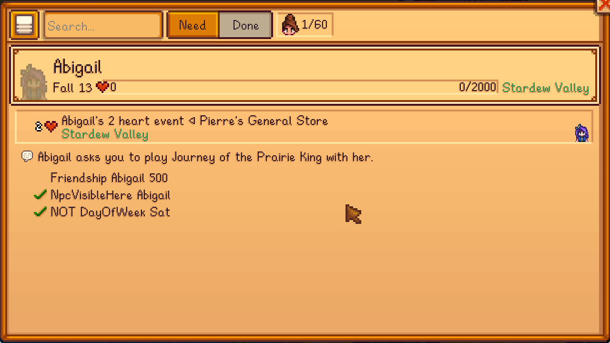

## Author Guide

This mod is mainly for players but there is a system of custom event name + descriptions for the event displaying pages.

Here's a content patcher example for adding name and description for your own events:

```js
{
  "$schema": "https://smapi.io/schemas/content-patcher.json",
  "Format": "2.9.0",
  "Changes": [
    {
      "Action": "EditData",
      // target this custom asset
      "Target": "mushymato.PerfectionHandbook/EventDesc",
      "Entries": {
        // add as many entries as you have events
        "<your event id>": {
          // the event name to be displayed instead of your event id
          "DisplayName": "{{i18n:1.name}}",
          // a short event description
          "Description": "{{i18n:1.desc}}",
          // a short event description, to be displayed if the player has seen the event
          "DescriptionSpoiler": "{{i18n:1.spoiler}}"
        }
      }
    }
  ]
}
```

If it worked, you can see your text in game under the 'Friends' page, like this:



Players can still display the mod ID by clicking on the event header, no need to worry about that.
